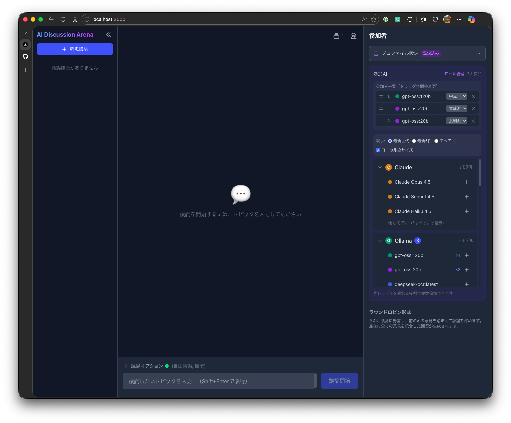
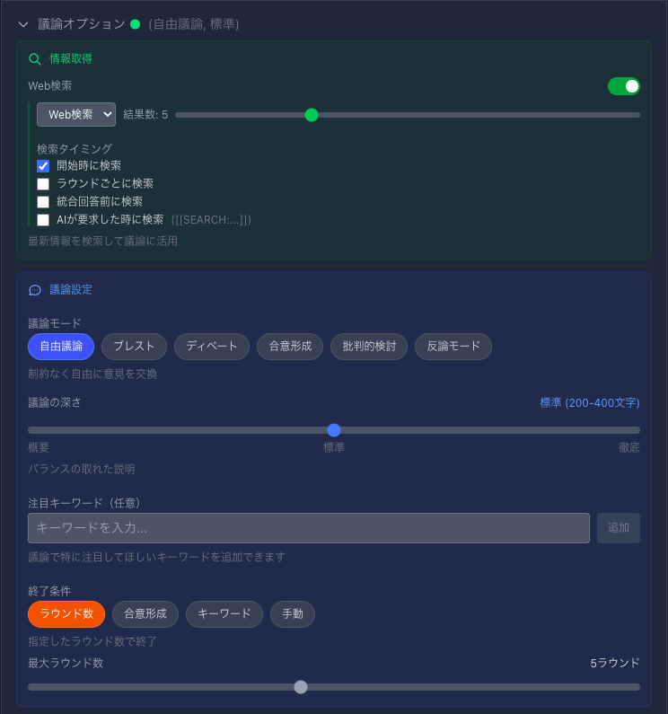
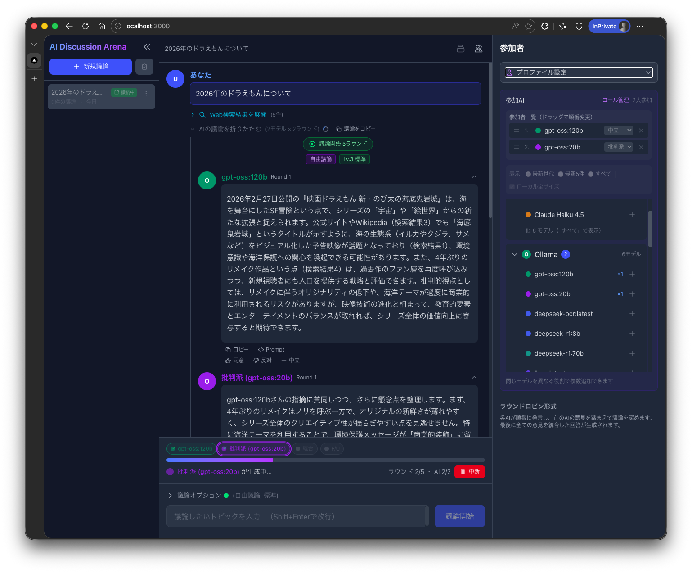
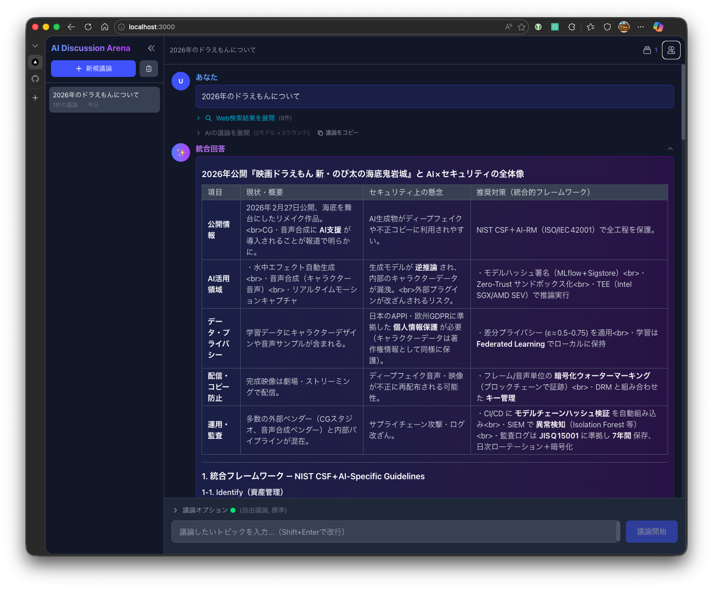
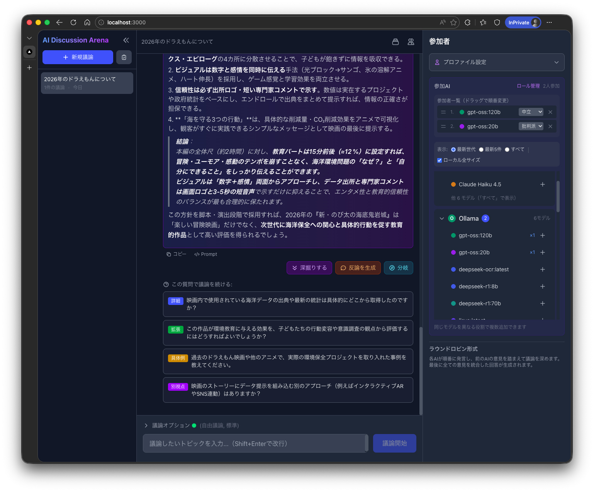

# AI Discussion Arena

複数のAI（Claude、Ollama、OpenAI、Gemini）がラウンドロビン形式で議論し、最終的に統合回答を生成するWeb UIアプリケーション。

[English README](README.md)



## スクリーンショット

| 議論オプション | 議論中 |
|:--:|:--:|
|  |  |

| 統合回答 | フォローアップ提案 |
|:--:|:--:|
|  |  |

## 機能

### 基本機能

- **マルチAI議論**: 複数のAIモデルが順番に発言し、前の意見を踏まえて議論を深める
- **ラウンドロビン形式**: 指定したラウンド数だけ各AIが順番に発言
- **統合回答生成**: 議論終了後、全ての意見を統合した回答を自動生成
- **リアルタイムストリーミング**: 各AIの回答をリアルタイムで表示
- **テキストファイル添付**: テキストファイルや長文コンテンツを議論の参考資料として添付可能
- **Web検索統合**: 複数のプロバイダー（Tavily、SearXNG、DuckDuckGo、Brave、Serper）を使用して最新情報を検索し、議論に反映
- **関連性フィルタリング**: AIによる関連性判定で低関連度の検索結果を除外
- **本題維持機能**: 議論が脱線しないよう本題への集中を維持
- **進捗の可視化**: 選択したモデルと実行状態（待機中/実行中/完了）を視覚的に表示
- **セッション管理**: 議論履歴をIndexedDBに保存、複数セッションの管理が可能
- **モデル絞り込み検索**: プロバイダー毎にモデル名で素早く絞り込み
- **レスポンシブ対応**: PC・モバイル両対応のUI

### 議論モード

- **Free**: 制約のない自由な議論
- **Brainstorm**: 多様なアイデアや可能性を生成
- **Debate**: 対立する視点を持つ構造化された議論
- **Consensus**: 参加者間での合意形成を目指す
- **Critique**: 批判的な分析と評価
- **Counterargument**: 反対意見の生成

### カスタマイズ機能

- **設定プリセット**: 議論設定を保存・読み込みして素早く再利用
- **ユーザープロファイル**: 技術レベル、回答スタイル、関心領域を設定
- **カスタムロール**: 参加者にカスタマイズしたプロンプトでロールを定義
- **議論の深さ**: 5段階の深さ設定（概要から徹底分析まで）
- **方向性ガイド**: キーワード、深掘り領域、避けたいトピックで議論の方向性をガイド

### 高度な機能

- **フォローアップ提案**: 議論後にAIが生成する追加質問
- **深掘り分析**: 特定トピックの詳細な分析
- **議論のフォーク**: 別の方向性を探るための議論の分岐
- **議論の延長**: 完了した議論を追加ラウンドや変更した設定で延長
- **メッセージ投票**: 議論内の個々のメッセージを評価
- **中断した議論の復旧**: 中断された議論を再開
- **終了条件**: ラウンド数、合意検出、キーワードトリガーで議論を終了

## 対応AIプロバイダー

| プロバイダー | タイプ | 必要なもの |
| --- | --- | --- |
| **Claude** | クラウドAPI | Anthropic APIキー |
| **Ollama** | ローカル | Ollamaサーバー起動 |
| **OpenAI** | クラウドAPI | OpenAI APIキー |
| **Gemini** | クラウドAPI | Google AI APIキー |

## セットアップ

### 前提条件

- **Node.js** 18.x以降
- **npm** または **yarn**
- 少なくとも1つのAIプロバイダーの設定:
  - Claude用のAnthropic APIキー
  - ローカルモデル用のOllamaインストール・起動
  - ChatGPT用のOpenAI APIキー
  - Gemini用のGoogle AI APIキー

### 1. リポジトリのクローン

```bash
git clone https://github.com/ngc-shj/ai-discussion-app.git
cd ai-discussion-app
```

### 2. 依存関係のインストール

```bash
npm install
```

### 3. 環境変数の設定

`.env.local.example`を元に`.env.local`ファイルを作成:

```bash
cp .env.local.example .env.local
```

`.env.local`を編集してAPIキーを設定:

```env
# Anthropic (Claude)
ANTHROPIC_API_KEY=sk-ant-xxxxx

# OpenAI
OPENAI_API_KEY=sk-xxxxx

# Google AI (Gemini)
GOOGLE_AI_API_KEY=xxxxx

# Ollama (デフォルト: localhost:11434)
OLLAMA_BASE_URL=http://localhost:11434

# 検索プロバイダー（少なくとも1つを推奨）
# 優先順位: Tavily > SearXNG > Serper > Brave > DuckDuckGo
TAVILY_API_KEY=tvly-xxxxx          # Tavily（AI最適化検索）
SEARXNG_BASE_URL=http://localhost:8080  # SearXNG（セルフホスト）
SERPER_API_KEY=xxxxx               # Serper（Google検索結果）
BRAVE_SEARCH_API_KEY=xxxxx         # Brave Search
# DuckDuckGo: APIキー不要（フォールバック）

# Jina Reader（オプション、ページ全文取得用）
JINA_API_KEY=jina_xxxxx            # オプション: キーあり500 RPM、なし20 RPM
```

> **注意**: 使用するプロバイダーのみ設定すれば大丈夫です。

### 4. 開発サーバーの起動

```bash
npm run dev
```

ブラウザで [http://localhost:3000](http://localhost:3000) を開く。

## Docker セットアップ（代替方法）

Dockerを使用してアプリケーションを実行することもできます:

### クイックスタート

```bash
# .envファイルを作成
cp .env.example .env
# .envを編集してAPIキーを設定

# アプリを起動
docker compose up -d app
```

ブラウザで [http://localhost:3000](http://localhost:3000) を開く。

### オプションサービスとの起動

```bash
# Ollama（ローカルLLM）と一緒に起動
docker compose --profile ollama up -d

# SearXNG（検索エンジン）と一緒に起動
docker compose --profile search up -d

# 全サービスを起動
docker compose --profile full up -d
```

### ソースからビルド

```bash
docker compose build app
docker compose up -d app
```

## プロバイダー別セットアップ詳細

### Ollama（ローカルモデル）

1. [ollama.ai](https://ollama.ai/) からOllamaをインストール

2. 使用したいモデルをプル:

   ```bash
   ollama pull gemma2:2b
   ollama pull qwen3:4b
   ollama pull llama3.2:3b
   ```

3. Ollamaサーバーが起動していることを確認:

   ```bash
   ollama serve
   ```

### Web検索プロバイダー

複数の検索プロバイダーに対応しています。Web検索機能を使用するには、少なくとも1つの設定を推奨します。

| プロバイダー | タイプ | APIキー | 備考 |
| --- | --- | --- | --- |
| **Tavily** | クラウドAPI | 必要 | AI最適化検索、推奨 |
| **SearXNG** | セルフホスト | 不要 | プライバシー重視のメタ検索 |
| **Serper** | クラウドAPI | 必要 | Google検索結果をAPI経由で取得 |
| **Brave** | クラウドAPI | 必要 | 独自インデックス、プライバシー重視 |
| **DuckDuckGo** | パブリック | 不要 | 常にフォールバックとして利用可能 |

**優先順位**: 複数のプロバイダーが設定されている場合、自動的に優先順位で選択: Tavily > SearXNG > Serper > Brave > DuckDuckGo。UIから手動で選択することも可能です。

#### Tavily（推奨）

1. [tavily.com](https://tavily.com/) からAPIキーを取得
2. `.env.local`に`TAVILY_API_KEY`を設定

#### SearXNG（セルフホスト）

**推奨**: [ngc-shj/searxng-mcp-server](https://github.com/ngc-shj/searxng-mcp-server)の設定済みDockerセットアップを使用:

```bash
git clone https://github.com/ngc-shj/searxng-mcp-server.git
cd searxng-mcp-server
docker run -d \
  -p 8080:8080 \
  -v $(pwd)/searxng-config/settings.yml:/etc/searxng/settings.yml:ro \
  -e SEARXNG_BASE_URL=http://localhost:8080/ \
  searxng/searxng
```

`.env.local`に`SEARXNG_BASE_URL`を設定。

#### その他のプロバイダー

- **Serper**: [serper.dev](https://serper.dev/) からAPIキーを取得
- **Brave**: [brave.com/search/api](https://brave.com/search/api/) からAPIキーを取得
- **DuckDuckGo**: 設定不要、常に利用可能

## 使い方

1. **AIモデルを選択**: 右側の設定パネルで参加するAIモデルにチェック
2. **ラウンド数を設定**: 議論のラウンド数を選択（1〜5）
3. **Web検索を有効化**（オプション）: 「Web検索を使用」をONにして最新情報を検索
4. **議論を開始**: トピックを入力して「議論開始」をクリック
5. **結果を確認**: 各AIが順番に回答し、最後に統合回答が生成される

### Web検索機能

有効にすると、関連情報を検索してAI参加者に提供:

- **検索プロバイダー**: Tavily、SearXNG、DuckDuckGo、Brave、Serperから選択
- **検索タイプ**: Web検索またはニュース検索
- **検索結果数**: 3〜10件の検索結果
- **詳細取得**: Jina Readerでページ全文をオプションで取得
- **検索タイミング**:
  - **議論開始前のみ**: 議論開始前に1回検索（デフォルト）
  - **各ラウンド開始時**: 各ラウンドの開始時に最新情報を検索
  - **オンデマンド**: AIが議論中に`{{SEARCH:クエリ}}`パターンで検索をリクエスト可能
- 結果は折りたたみセクションに表示され、全AIの参加者に提供される

## 技術スタック

- **フレームワーク**: Next.js 16 (App Router)
- **言語**: TypeScript 5
- **UI**: React 19
- **スタイリング**: Tailwind CSS 4
- **データ永続化**: IndexedDB (idb)
- **AI SDK**:
  - `@anthropic-ai/sdk` (Claude)
  - `openai` (OpenAI)
  - `@google/generative-ai` (Gemini)
  - Ollama (HTTP API)
- **Markdown**: react-markdown, remark-gfm, rehype-highlight
- **ストリーミング**: Server-Sent Events (SSE)

## プロジェクト構成

```text
ai-discussion-app/
├── src/
│   ├── app/
│   │   ├── page.tsx           # メインUI
│   │   └── api/
│   │       ├── discuss/       # 議論APIエンドポイント (SSE)
│   │       ├── models/        # 利用可能モデルエンドポイント
│   │       ├── providers/     # プロバイダー可用性チェック
│   │       ├── search/        # SearXNG検索エンドポイント
│   │       └── summarize/     # 統合回答生成
│   ├── components/            # React UIコンポーネント (~30)
│   │   ├── DiscussionPanel.tsx
│   │   ├── SettingsPanel.tsx
│   │   ├── InputForm.tsx
│   │   ├── AISelector.tsx
│   │   ├── RoleEditor.tsx
│   │   ├── FinalAnswer.tsx
│   │   ├── FollowUpSuggestions.tsx
│   │   ├── DeepDiveModal.tsx
│   │   ├── ForkModal.tsx
│   │   ├── PresetManagerModal.tsx
│   │   ├── UserProfileSettings.tsx
│   │   └── ...
│   ├── hooks/                 # カスタムReactフック (~10)
│   │   ├── useDiscussion.ts
│   │   ├── useDiscussionSettings.ts
│   │   ├── useSessionManager.ts
│   │   ├── usePresetManager.ts
│   │   └── ...
│   ├── lib/
│   │   ├── ai-providers/      # AIプロバイダー実装
│   │   ├── discussion-engine/ # 議論オーケストレーション
│   │   ├── session-storage.ts
│   │   └── sse-utils.ts
│   └── types/                 # TypeScript型定義 (~10)
│       ├── index.ts
│       ├── provider.ts
│       ├── participant.ts
│       ├── message.ts
│       ├── config.ts
│       ├── session.ts
│       ├── preset.ts
│       └── ...
├── .env.local.example
└── package.json
```

## トラブルシューティング

### 「Provider not available」エラー

- **Ollama**: `ollama serve`が起動中で、設定されたURLでアクセス可能か確認
- **クラウドAPI**: `.env.local`でAPIキーが正しく設定されているか確認
- ブラウザのコンソールで詳細なエラーメッセージを確認

### モデルが表示されない

- Ollamaの場合、少なくとも1つのモデルをプル済みか確認（`ollama list`でチェック）
- クラウドプロバイダーの場合、APIキーに必要な権限があるか確認

### Web検索が動作しない

- **DuckDuckGo**: フォールバックとして常に動作するはず（設定不要）
- **SearXNG**: 起動中でJSON形式が有効か確認
- **APIベースのプロバイダー**: `.env.local`でAPIキーが正しく設定されているか確認
- ブラウザコンソールとサーバーログで詳細なエラーメッセージを確認

## ライセンス

MIT License - 詳細は [LICENSE](LICENSE) ファイルを参照してください。
